# Apache 02- NGINX

## Tabla de Contenidos

- [Explicación](#explicación)
- [Dominios](#dominios)
- [Configuración por defecto](#configuración-por-defecto)
- [yahya.com](#yahacom)
- [www.elhadri.com](#wwwelhadricom)
- [seguro.net](#seguronet)
- [seguro.net/secreto](#seguronetsecreto)
- [Hosts](#hosts)
- [Docker-compose](#docker-compose)
- [Ejecución](#ejecución)


## Explicación

Este despliegue incluye la configuración de tres dominios diferentes utilizando un servidor NGINX, con autenticación básica en una página específica y certificados SSL generados con OpenSSL para `seguro.net`. La configuración se implementa dentro de un contenedor Docker.


## Dominios

- yahya.com
- www.elhadri.com
- seguro.net

## Configuración por defecto

Antes de empezar, configuramos NGINX para escuchar en los puertos 80 y 443. Los archivos de configuración están en la carpeta `sites-available`, y se activan mediante enlaces simbólicos en `sites-enabled`. También incluimos una página HTML por defecto en el directorio de cada dominio.


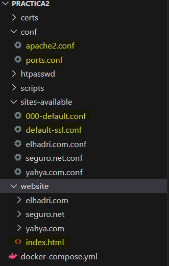

## yahya.com

El primer paso que debemos hacer es crear, dentro de nuestra carpeta `website`, la carpeta que va a incluir nuestros HTML, en nuestro caso el `index` y el `error404`.

Una vez tenemos nuestro dominio en `website`, vamos a la carpeta de `sites-available` y creamos el server para nuestro dominio, definimos el nombre del servidor, su alias y, en caso de algún error, dónde redireccionarlo.

```nginx
server {
    listen 80; 
    listen [::]:80;

    server_name yahya.com; 

    root /var/www/html/yahya.com;
    index index.html;

    error_page 404 /error_404.html;
    location = /error_404.html {
        root /var/www/html/yahya.com;
        internal;
    }
}
```
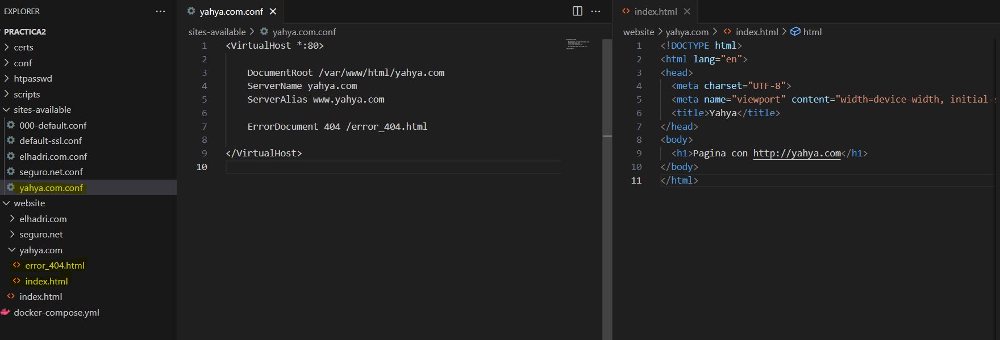

## www.elhadri.com

## www.elhadri.com

Son los mismos pasos que en la primera de yahya.com. El primer paso que debemos hacer es crear, dentro de nuestra carpeta `website`, la carpeta que va a incluir nuestros HTML, en nuestro caso el `index` y el `error404`.

Una vez tenemos nuestro dominio en `website`, vamos a la carpeta de `sites-available` y creamos el server para nuestro dominio, definimos el nombre del servidor, su alias y, en caso de algún error, dónde redireccionarlo.

```nginx
server {
    listen 80;
    listen [::]:80;

    server_name www.elhadri.com; 

    root /var/www/html/elhadri.com;
    index index.html;

    error_page 404 /error_404.html;
    location = /error_404.html {
        root /var/www/html/elhadri.com;
        internal;
    }
}

```

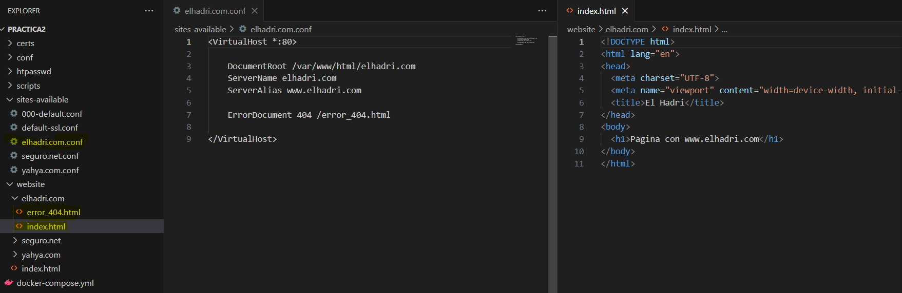


## seguro.net

Para seguro.net, son los mismos pasos que las otras dos. Añadimos nuestros HTML a `website` y, en nuestro server, tenemos que hacerle como un mapeo para que, en caso de que nos entre por el puerto 80, lo redirijamos al 443, que es el que nos interesa, ya que es el de una conexión segura con SSL.

```nginx
server {
    listen 80;
    listen [::]:80;

    server_name www.seguro.net seguro.net;

    return 301 https://seguro.net;
}
```

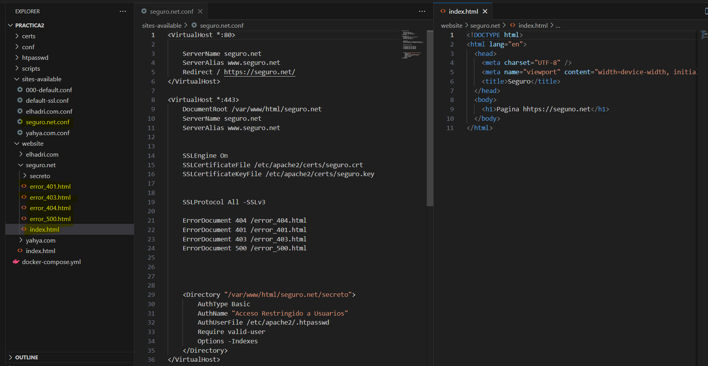


Para tener nuestra conexión segura, necesitamos tener nuestros certificados, los cuales tenemos que generar con este comando. Una vez los genera, nos los deja automáticamente en C. Nosotros tenemos que copiarlos a nuestra carpeta de `certs` en nuestro proyecto.

```
    openssl req -x509 -nodes -days 365 -newkey rsa:2048 -keyout seguro.key -out seguro.crt
```

Para poder añadir estos certificados a nuestro server, tenemos que añadir las líneas de ssl e indicarle dónde están nuestros certificados.


```
    ssl_certificate /etc/nginx/certs/seguro.crt;
    ssl_certificate_key /etc/nginx/certs/seguro.key;

    ssl_protocols TLSv1.2 TLSv1.3;
    ssl_ciphers 'EECDH+AESGCM:EDH+AESGCM:AES256+EECDH:AES256+EDH';
    ssl_prefer_server_ciphers on; 
    
```

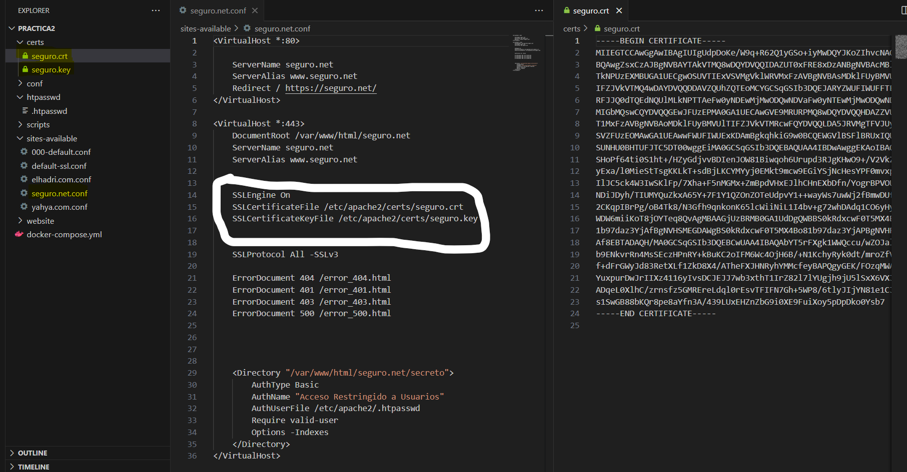

## seguro.net/secreto
Nos queda el último paso, que es añadir nuestra página secreta, la cual queremos que tenga un usuario y contraseña. Para ello, añadimos nuestro HTML y nos vamos al `conf` de nuestro dominio que es seguro.net. En el server, añadimos las líneas de donde queremos que sea obligatorio que el usuario esté previamente registrado para poder acceder a la página. Esa contraseña tiene que estar cifrada, porque si no, cualquiera podría acceder.

```nginx
location /secreto {
    auth_basic "Acceso Restringido";
    auth_basic_user_file /etc/nginx/.htpasswd;
}

```

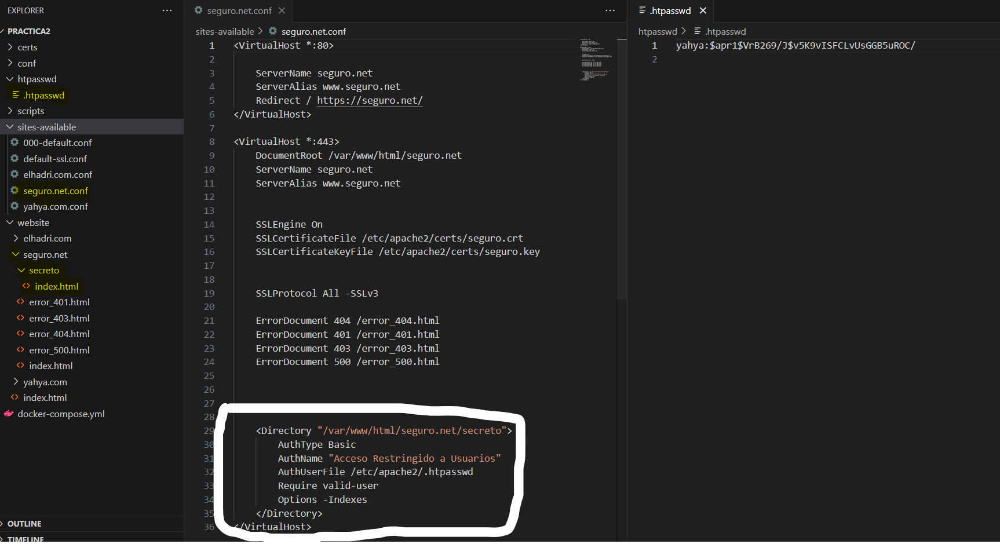


Este es el comando que necesitamos para crear nuestra contraseña. Yo lo tengo creado en mi directorio personal y luego lo corto y lo pego en el del proyecto porque me daba problemas al hacerlo directamente en mi proyecto.

```
    htpasswd -c C:\Users\anasm\.htpasswd yahya

```

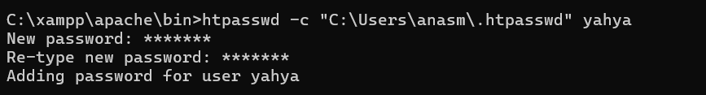

## Hosts

El último paso, antes del `docker-compose`, es cambiar nuestros hosts y añadir los nuevos dominios.


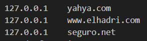


## Docker-compose

```
services:
  web:
    image: ubuntu/nginx 
    container_name: nginx_server 
    ports:
      - "80:80" 
      - "443:443"
    volumes:
      - ./conf/nginx.conf:/etc/nginx/nginx.conf 
      - ./sites-available:/etc/nginx/sites-available 
      - ./website:/var/www/html/
      - ./scripts:/docker-entrypoint.d/ 
      - ./htpasswd/.htpasswd:/etc/nginx/.htpasswd 
      - ./certs:/etc/nginx/certs 
    restart: always 
```

En el Docker, creamos nuestro servicio web, le indicamos nuestra imagen que vamos a utilizar. Le damos el nombre del contenedor, mapeamos los puertos, que son el del Apache y el del SSL. Indicamos también qué directorios queremos copiar y dónde los queremos. Y por último, ejecutamos nuestro script siempre que inicie el contenedor.

```
#!/bin/bash

if [ ! -L /etc/nginx/sites-enabled/yahya.com.conf ]; then
  ln -s /etc/nginx/sites-available/yahya.com.conf /etc/nginx/sites-enabled/
fi

if [ ! -L /etc/nginx/sites-enabled/elhadri.com.conf ]; then
  ln -s /etc/nginx/sites-available/elhadri.com.conf /etc/nginx/sites-enabled/
fi

if [ ! -L /etc/nginx/sites-enabled/seguro.net.conf ]; then
  ln -s /etc/nginx/sites-available/seguro.net.conf /etc/nginx/sites-enabled/
fi

nginx -s reload

nginx -g 'daemon off;'
```

## Ejecución

Lanzamos el `docker-compose up`.

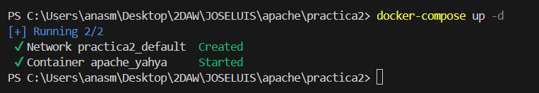


Comprobamos desde Docker Desktop y vemos los directorios nuevos del contenedor y el origen, es decir, lo que hemos puesto en `volumes` en el `docker-compose`.

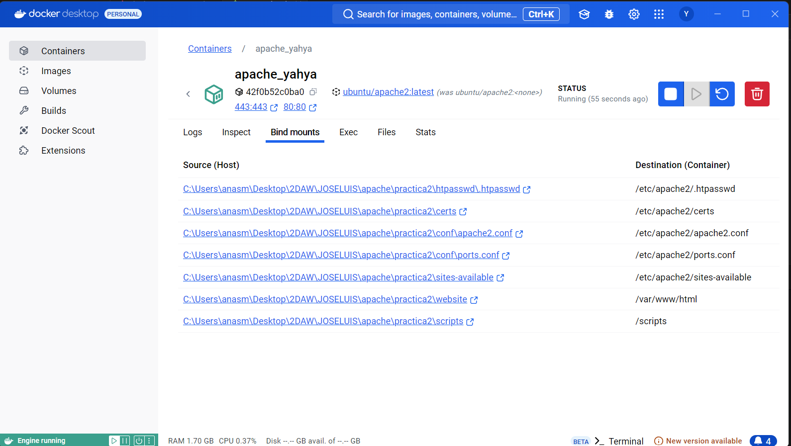


Comprobamos que yahya.com funciona y que la conexion no segura.

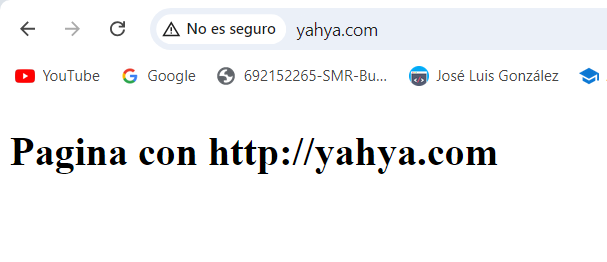


Comprobamos que elhadri.com funciona y que la conexion no segura.

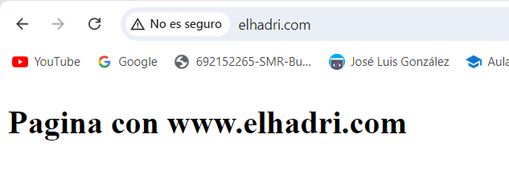


Comprobamos que seguro.net funciona y nos recoge también nuestro certificado.

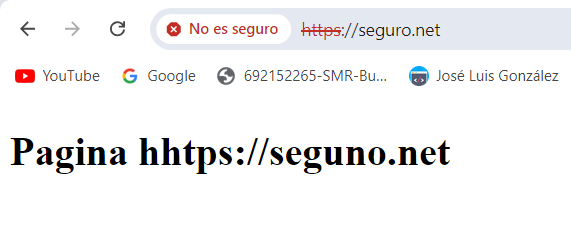 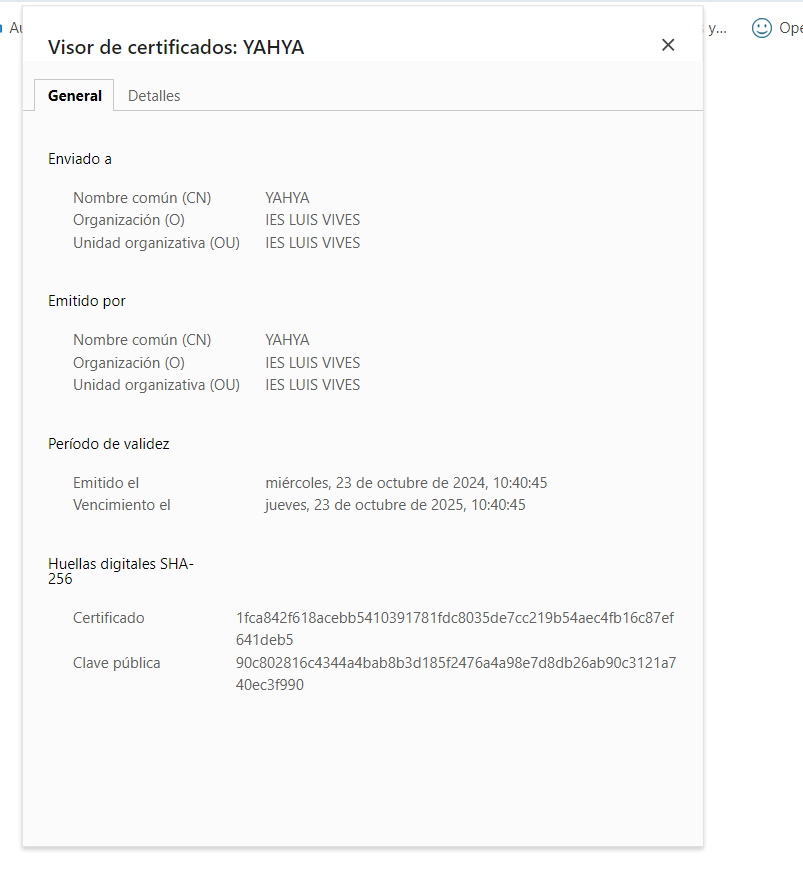


Comprobamos que seguro.net/secreto funciona y nos pide iniciar sesión con nuestro usuario y contraseña. Y funciona.

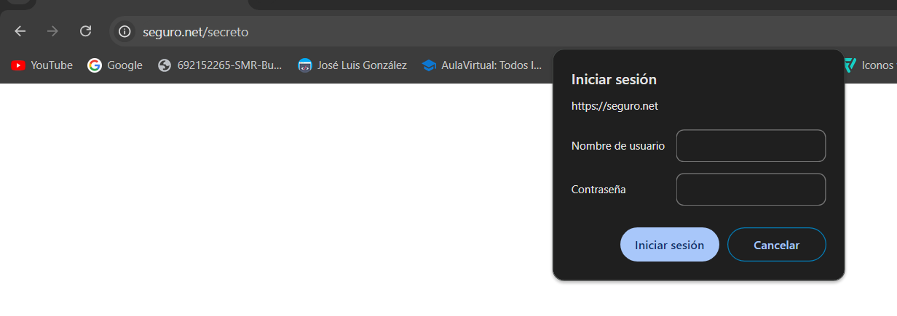 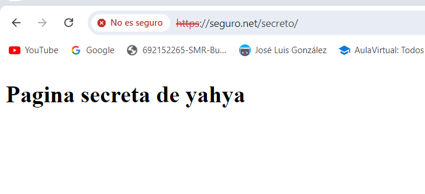


